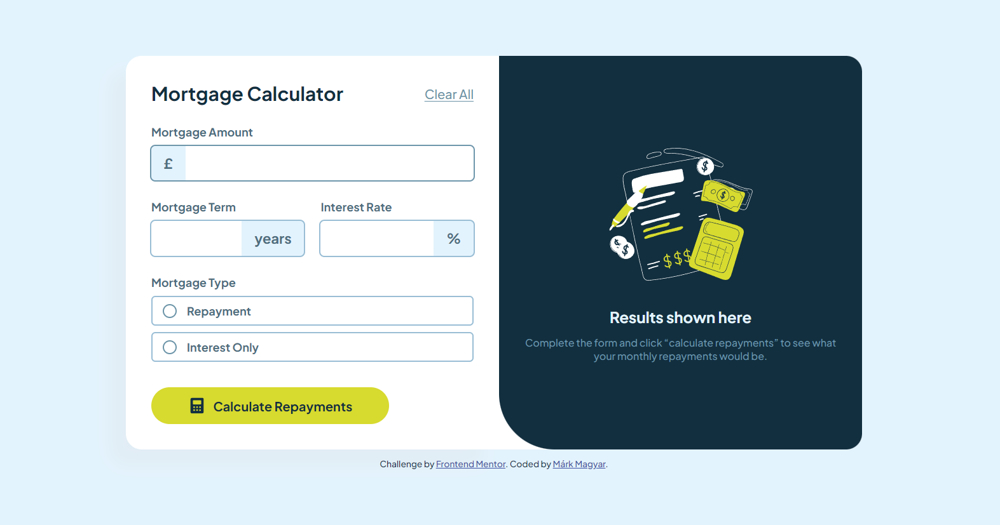

# Frontend Mentor - Mortgage repayment calculator solution

This is a solution to the [Mortgage repayment calculator challenge on Frontend Mentor](https://www.frontendmentor.io/challenges/mortgage-repayment-calculator-Galx1LXK73). Frontend Mentor challenges help you improve your coding skills by building realistic projects. 

## Table of contents

- [Overview](#overview)
  - [The challenge](#the-challenge)
  - [Screenshot](#screenshot)
  - [Links](#links)
- [My process](#my-process)
  - [Built with](#built-with)
- [Author](#author)

## Overview

### The challenge

Users should be able to:

- Input mortgage information and see monthly repayment and total repayment amounts after submitting the form
- See form validation messages if any field is incomplete
- Complete the form only using their keyboard
- View the optimal layout for the interface depending on their device's screen size
- See hover and focus states for all interactive elements on the page

### Screenshot

### Links

- Source code URL: [https://github.com/MaelkMark/maelkmark.github.io/tree/master/frontendmentor/mortgage-calculator](https://github.com/MaelkMark/maelkmark.github.io/tree/master/frontendmentor/mortgage-calculator)
- Live Site URL: [https://maelkmark.github.io/frontendmentor/mortgage-calculator](https://maelkmark.github.io/frontendmentor/mortgage-calculator)

## My process

### Built with

- HTML
- CSS
- CSS Grid
- JS
- No frameworks

## Author

- Github homepage - [maelkmark.github.io](https://maelkmark.github.io)
- Github - [@MaelkMark](https://github.com/maelkmark)
- Frontend Mentor - [@MaelkMark](https://www.frontendmentor.io/profile/maelkmark)

