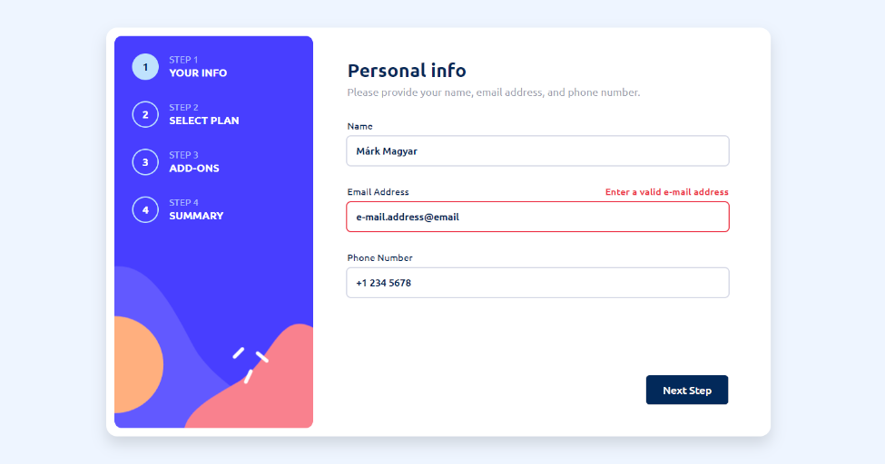

# Frontend Mentor - Multi-step form solution

This is a solution to the [Multi-step form challenge on Frontend Mentor](https://www.frontendmentor.io/challenges/multistep-form-YVAnSdqQBJ). Frontend Mentor challenges help you improve your coding skills by building realistic projects. 

## Table of contents

- [Overview](#overview)
  - [The challenge](#the-challenge)
  - [Screenshot](#screenshot)
  - [Links](#links)
- [My process](#my-process)
  - [Built with](#built-with)
  - [What I learned](#what-i-learned)
- [Author](#author)

## Overview

### The challenge

Users should be able to:

- Complete each step of the sequence
- Go back to a previous step to update their selections
- See a summary of their selections on the final step and confirm their order
- View the optimal layout for the interface depending on their device's screen size
- See hover and focus states for all interactive elements on the page
- Receive form validation messages if:
  - A field has been missed
  - The email address is not formatted correctly
  - A step is submitted, but no selection has been made

### Screenshot

### Links

- Solution URL: [https://github.com/MaelkMark/maelkmark.github.io/tree/master/frontendmentor/multi-step-form](https://github.com/MaelkMark/maelkmark.github.io/tree/master/frontendmentor/multi-step-form)
- Live Site URL: [https://maelkmark.github.io/multi-step-form](https://maelkmark.github.io/multi-step-form)

## My process

### Built with

- Only HTML & CSS
- CSS Flexbox
- CSS Grid
- No js
- No frameforks

### What I learned

I learned a lot about how can I achive things with only css that I used to do with js. I know in a complicated project using only css isn't the correct approach and it's hard to maintain but this was a challenge for me.

## Author

- Github homepage - [maelkmark.github.io](https://maelkmark.github.io)
- Github - [@MaelkMark](https://github.com/maelkmark)
- Frontend Mentor - [@MaelkMark](https://www.frontendmentor.io/profile/maelkmark)
